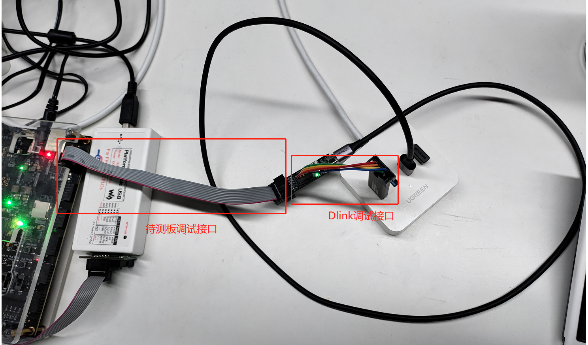
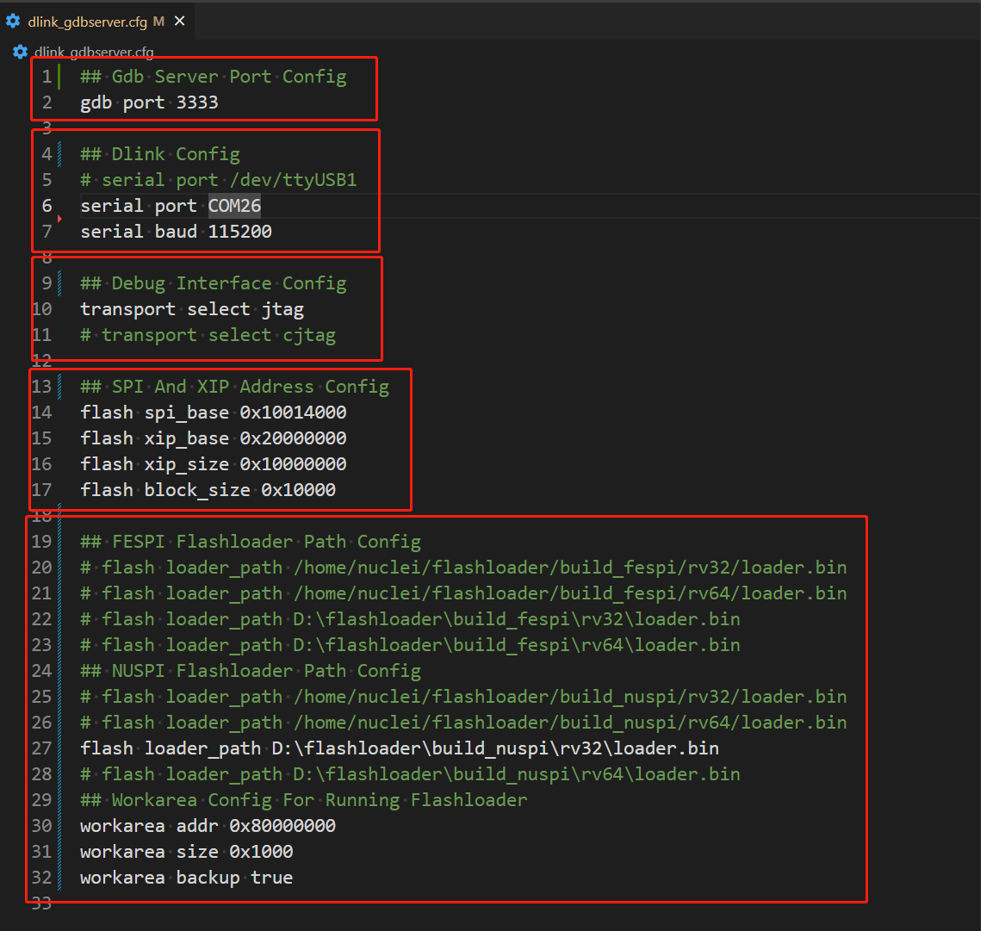

# Introduction

Dlink is developed based on RV-Link, and many new functions are added on its basis.
At present, Dlink is only applicable to RV-STAR or DLink Debugger development board as a debugger.
This document mainly introduces the new features of dlink, how to run Dlink in RV-STAR or DLink Debugger,
how to connect hardware and how to use software.

# Involved Repos

- Nuclei SDK: https://github.com/Nuclei-Software/nuclei-sdk
- Nuclei DLink: https://github.com/Nuclei-Software/nuclei-dlink
- Nuclei DLink GDBServer: https://github.com/Nuclei-Software/nuclei-dlink_gdbserver
- Open Flashloader: https://github.com/riscv-mcu/openflashloader

# New Features of DLink

- RV32/RV64

- support f/d/v/p extension

- support more csr register

- JTAG/C-JTAG

- abstract

- progbuf

- read/write register

- read/write memory

- read/write flash

- support openocd-flashloader

- software(32)/hardware(8) breakpoint

# Demo DLink Harware Connection based on RV-STAR


| PC  | Dlink  | Dlink       | Board |
| --- | ------ | ----------- | ----- |
| USB | Type-C | GPIOA_Pin4  | TCK   |
|     |        | GPIOB_Pin15 | TMS   |
|     |        | GPIOB_Pin14 | TDI   |
|     |        | GPIOB_Pin13 | TDO   |
|     |        | GND         | GND   |

# Dlink v1.0.0 Hardware Connection



| PC  | Dlink  | Dlink       | Board |
| --- | ------ | ----------- | ----- |
| USB | Type-C | 10pin cable | cable |

# How to use dlink

## Clone Repository

```bash
# clone nuclei-sdk develop branch
git clone -b develop https://github.com/Nuclei-Software/nuclei-sdk
# clone dlink
git clone https://github.com/Nuclei-Software/nuclei-dlink
# clone dlink-gdb-server
git clone https://github.com/Nuclei-Software/nuclei-dlink_gdbserver
# clone flashloader
git clone https://github.com/riscv-mcu/openflashloader
```

## Run steps

### dlink firmware program

This step below is used to compile dlink firmware, and upload
it to rvstar or dlink debugger board using JTAG.

> Make sure RV-STAR or DLink board is connected to your PC.
>
> DLink debugger board JTAG is not by default exposed for development,
> you can upload firmware `dlink.hex` built for DLink board
> via **GD32V DFU tools**.

```bash
cd nuclei_dlink
# Suppose three git repositories are in the same directory
# If it is not please modify NUCLEI_SDK_ROOT in Makefile
# if you want to build for gd32vf103v_rvstar board
# set BOARD=gd32vf103v_rvstar
make BOARD=gd32vf103v_rvstar clean
make BOARD=gd32vf103v_rvstar -j dasm
# upload to rvstar board using jtag
make BOARD=gd32vf103v_rvstar upload
```


### run dlink gdbserver

This step is used to bring up dlink gdb server, and wait for
gdb connection.

```bash
cd dlink_gdbserver
# Install QT and compile run dlink_gdbserver(Qt >= 6.3.1)
qtcreator dlink_gdbserver.pro &
# Or use the release version of dlink_gdbserver
./dlink_gdbserver
# Or run it in command line mode
./dlink_gdbserver -f ~/dlink_gdbserver.cfg
# Make sure your profile is correct
# then select dlink_gdbserver.cfg on the screen and click connect
```


### debug nuclei sdk application using gdb and dlink

Here assume you are using Nuclei demosoc, with UX900 CPU on Nuclei KU060 board.
And you have connect rvstar(dlink firmware programmed) debug pins to KU060 debug pins as
described above.

```bash
cd nuclei-sdk
cd application/baremetal/helloworld
# compile application helloworld
make SOC=demosoc CORE=ux900 clean all
# gdb connnect to previous step opened dlink gdbserver gdb port
make SOC=demosoc CORE=ux900 run_gdb
# Let's start debugging in gdb now
```


## Dlink Configuration File

- gdb server tcp/ip port
- dlink port and baud
- debug interface
- spi and xip
- flashloader



> Note: If there is no available ram in the SOC for workarea or you do not want to use flashloader, you can mask flashloader related configurations in the configuration file
