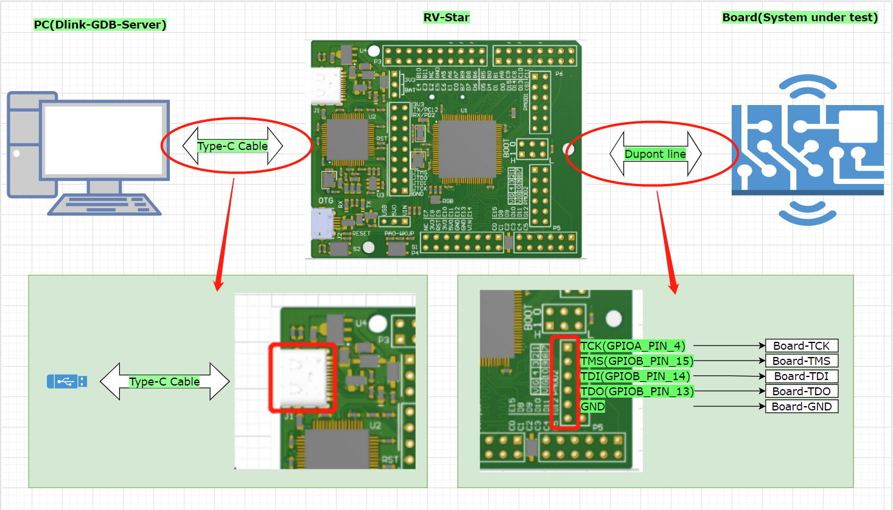

# Introduction

Dlink is developed based on RV-Link, and many new functions are added on its basis. At present, Dlink is only applicable to RV-STAR development board as a debugger. This document mainly introduces the new features of dlink, how to run Dlink in RV-STAR, how to connect hardware and how to use software.

# Involved Repos

- Nuclei SDK: https://github.com/Nuclei-Software/nuclei-sdk
- Nuclei DLink: https://github.com/Nuclei-Software/nuclei-dlink
- Nuclei DLink GDBServer: https://github.com/Nuclei-Software/nuclei-dlink_gdbserver

# New Features of DLink

- RV32/RV64

- support f/d/v/p extension

- support more csr register

- JTAG/C-JTAG

- abstract

- progbuf

- read/write register

- read/write memory

- read/write flash

- support openocd-flashloader

- software(32)/hardware(8) breakpoint

# Demo DLink Harware Connection based on RV-STAR



| PC  | Dlink  | Dlink       | Board |
| --- | ------ | ----------- | ----- |
| USB | Type-C | GPIOA_Pin4  | TCK   |
|     |        | GPIOB_Pin15 | TMS   |
|     |        | GPIOB_Pin14 | TDI   |
|     |        | GPIOB_Pin13 | TDO   |
|     |        | GND         | GND   |

# How to use dlink

## Clone Repository

## Run steps

### dlink firmware program

This step below is used to compile dlink firmware, and upload
it to rvstar board.

> Make sure RV-STAR board is connected to your PC.

```bash
cd  nuclei_dlink
# Suppose three git repositories are in the same directory
# If it is not please modify Makefile
make clean all upload
```

### run dlink gdbserver

This step is used to bring up dlink gdb server, and wait for
gdb connection.

```bash
cd dlink_gdbserver
# Install QT and compile run dlink_gdbserver
qtcreator dlink_gdbserver.pro &
# Or use the release version of dlink_gdbserver
./dlink_gdbserver
# Make sure your profile is correct
# then select dlink_gdbserver.cfg on the screen and click connect
```

### debug nuclei sdk application using gdb and dlink

Here assume you are using Nuclei demosoc/evalsoc, with N300FD CPU on Nuclei DDR200T board.
And you have connect rvstar(dlink firmware programmed) debug pins to DDR200T debug pins as
described above.

```bash
cd nuclei-sdk
cd application/baremetal/helloworld
# compile application helloworld
make SOC=demosoc CORE=n300fd clean all
# gdb connnect to previous step opened dlink gdbserver gdb port
make SOC=demosoc CORE=n300fd run_gdb
# Let's start debugging in gdb now
```

# DLink GDBServer Configuration File

The dlink gdb server configuration file is named as dlink_gdbserver.cfg, below
is a sample version.

```textile
gdb port 3333

# The value must be modified according to the actual situation
serial port /dev/ttyUSB1
# It should not be modified unless you have modified board.c
serial baud 115200

# The value must be modified according to the system configuration
transport select jtag
# transport select cjtag

# The value must be modified according to the system configuration
workarea addr 0x80000000
workarea size 0x1000
workarea backup true

# The value must be modified according to the system configuration
flash spi_base 0x10014000
flash xip_base 0x20000000
flash xip_size 0x10000000
flash block_size 0x10000
# flash loader_path /home/nuclei/Git/openocd-flashloader/build/rv32/loader.bin
flash loader_path /home/nuclei/Git/openocd-flashloader/build/rv64/loader.bin

```
